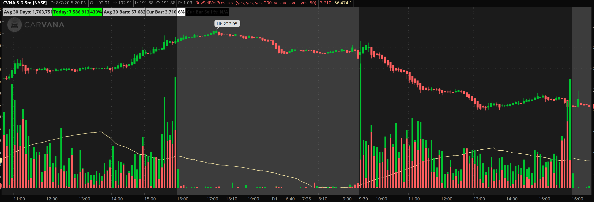

# Thinkscripts

ThinkOrSwim scripts

## To Install

It depends on the script. Each script would be in a directory that indicates what it is. Studies, Strategies, Watchlists, Alerts, Orders, and Scans. Each one is installed differently. Read [here](https://tlc.thinkorswim.com/center/reference/thinkScript) for more information: 

## Index

### Studies

### BuySellVolPressure

Show the volume with stacked sold and bought indications.

[Study](studies/buysellvolpressure)

